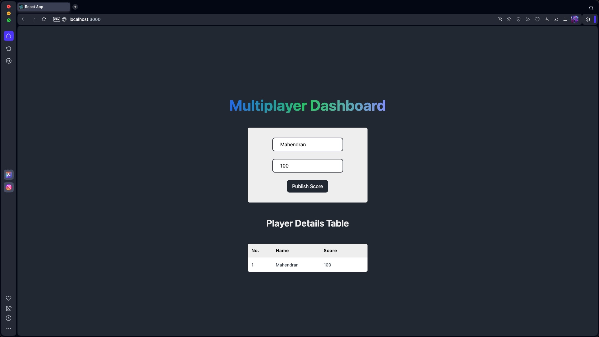
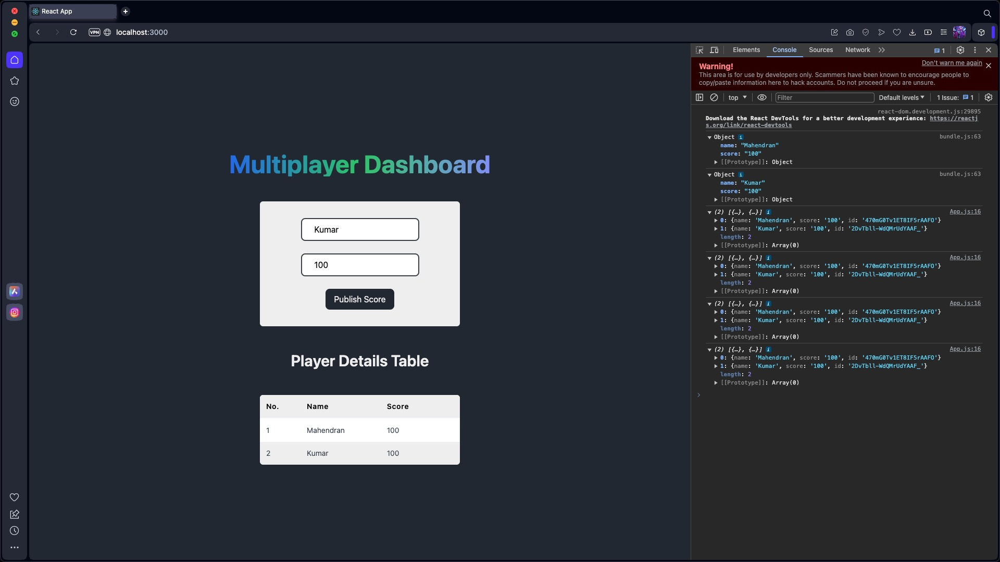

# Multiplayer Dashboard Using WebScokets

Welcome to the Multiplayer Dashboard Using WebScokets repository! This project is a real-time multiplayer dashboard developed using WebSockets technology. It allows users to add players and display their information on a table, with data updated in real-time.

Website Live on: [https://websocketmultiplayerdashboard.netlify.app](https://websocketmultiplayerdashboard.netlify.app)

## Features

- **Real-Time Updates:** The dashboard updates in real-time as player information is added or modified.
  
- **WebSocket Communication:** Real-time communication between the client and server is facilitated through WebSocket technology, ensuring instant data updates.
  
- **Responsive UI:** The application features a user-friendly and responsive interface built with React and styled using TailwindCSS for a smooth user experience.

## Getting Started

To set up and run the Multiplayer Dashboard App on your local machine, follow these steps:

1. Clone this repository
2. Navigate to the project directory: `cd Multiplayer-Dashboard-App`

### Backend Setup

3. Navigate to the backend directory: `cd server`
4. Install backend dependencies: `npm install`
5. Start the backend server: `npm start`

### Frontend Setup

6. Navigate to the frontend directory: `cd ../client`
7. Install frontend dependencies: `npm install`
8. Start the frontend development server: `npm start`

Open your browser and visit `http://localhost:3000` to access the application.

## Technologies Used

- **Node.js:** Backend server runtime environment.
  
- **Socket.IO:** Library for real-time, bidirectional communication between clients and servers.
  
- **React:** JavaScript library for building user interfaces.
  
- **TailwindCSS:** Utility-first CSS framework for styling the user interface.

## Screenshots

### Dashboard Interface

### Player Information

### Console Information

## Contributions

Contributions to enhance and improve the Multiplayer Dashboard App are welcome. If you're interested in contributing, follow these steps:

1. Fork the repository.
2. Create a new branch for your feature or bug fix: `git checkout -b feature/your-feature-name`.
3. Make your changes and commit them: `git commit -m 'Add your feature'`.
4. Push to your branch: `git push origin feature/your-feature-name`.
5. Open a pull request.

## Feedback and Issues

We value your feedback and welcome bug reports or suggestions for improvement. If you encounter any issues or have ideas for enhancements, please [open an issue](https://github.com/YourUsername/Multiplayer-Dashboard-App/issues).

Thank you for exploring the Multiplayer Dashboard App project! We hope it enhances your communication experience.
